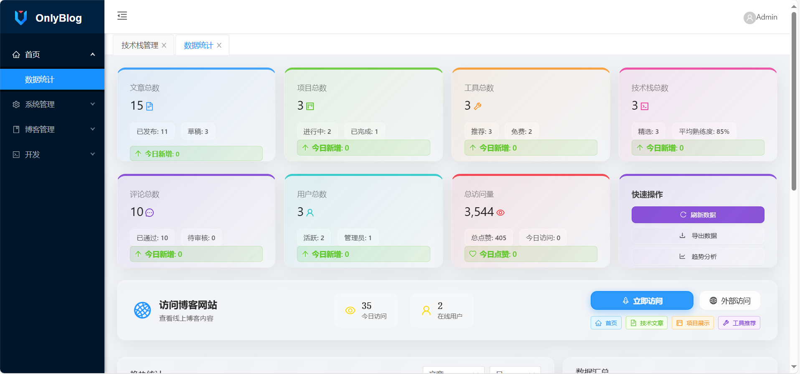
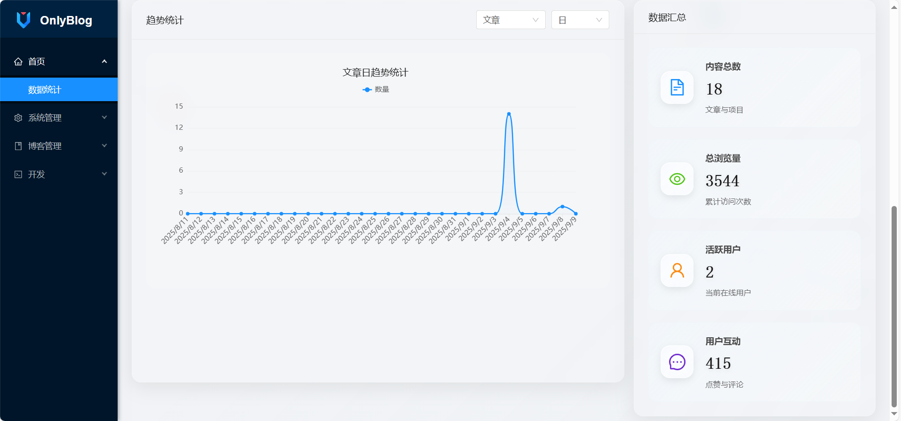
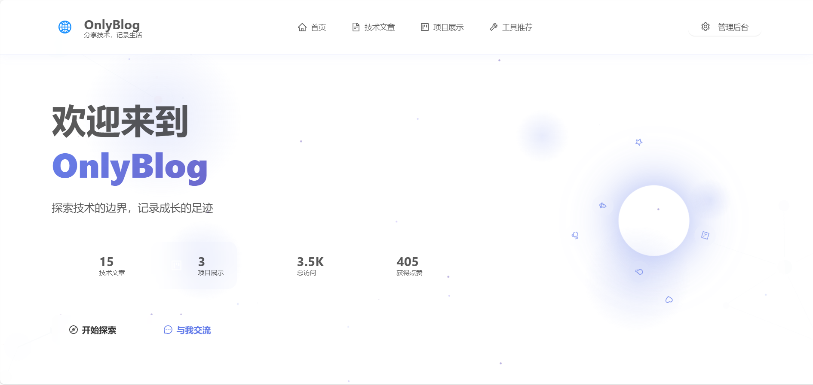
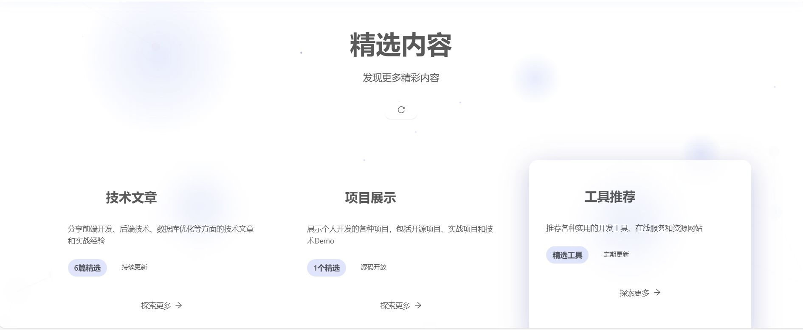

# OnlyBlog 博客系统

## 📋 项目概述

OnlyBlog 是一个现代化的个人博客系统，基于 .NET 5 和 Vue.js 构建，提供完整的博客管理和展示功能。系统采用前后端分离架构，支持技术文章、项目展示、工具推荐等多种内容类型。

### 基础框架

本项目基于 **Colder.Admin.AntdVue** 框架开发，这是一个优秀的 Web 后台快速开发框架，采用 .NET5 + Ant Design Vue 技术栈。

**框架资源：**
- **代码(GitHub)：** <https://github.com/Coldairarrow/Colder.Admin.AntdVue>  
- **文档(GitHub)：** <https://github.com/Coldairarrow/Colder.Admin.AntdVue/wiki>  
- **代码(码云镜像)：** <https://gitee.com/Coldairarrow/Colder.Admin.AntdVue>  
- **文档(码云镜像)：** <https://gitee.com/Coldairarrow/Colder.Admin.AntdVue/wikis>  
- **在线预览地址：** <http://coldairarrow.gitee.io/colder.amin.antdvue.preview.web/> （账号/密码：Admin 123456）

### 项目特色

在 Colder.Admin.AntdVue 基础框架之上，OnlyBlog 扩展实现了：
- 🎨 现代化的博客展示前台页面
- 📝 完整的技术文章管理系统
- 🚀 项目展示和介绍功能
- 🛠️ 开发工具推荐系统
- ✨ 玻璃形态设计 + 粒子动效
- 📱 全面的响应式适配

## 🎬 项目页面展示

### 管理端：





### 用户端：





### 页面设计特色

**🎨 现代化UI设计**
- **玻璃形态设计 (Glassmorphism)**: 所有卡片和组件采用半透明玻璃效果，配合模糊背景和渐变边框，营造现代科技感
- **渐变色彩方案**: 使用 `linear-gradient(135deg, #667eea 0%, #764ba2 100%)` 主色调，统一的紫蓝色系
- **圆角设计**: 16px 圆角半径，柔和的视觉效果
- **阴影层次**: 多层次阴影效果 `0 8px 32px rgba(102, 126, 234, 0.1)`

**✨ 动态粒子特效系统**
- **浮动粒子动画**: 页面背景包含 20-50 个动态粒子，随机分布并缓慢浮动
- **鼠标交互响应**: 粒子会根据鼠标位置进行偏移，营造沉浸式交互体验
- **自适应数量**: 不同页面根据复杂度调整粒子数量（首页50个，详情页20个）
- **性能优化**: 使用 CSS Transform 和 GPU 加速，确保流畅的动画效果

**🌟 交互动效**
- **悬停效果**: 卡片悬停时上移 4px 并增强阴影 `transform: translateY(-4px)`
- **平滑过渡**: 所有交互采用 `cubic-bezier(0.4, 0, 0.2, 1)` 缓动函数
- **微弹效果**: 按钮点击时轻微缩放和颜色变化
- **滚动视差**: 背景粒子随滚动产生轻微视差效果

**📱 响应式设计**
- **移动优先**: 采用移动优先的响应式设计策略
- **断点适配**: 768px、1200px 主要断点，完美适配手机、平板、桌面
- **布局重排**: 大屏网格布局，小屏堆叠布局
- **字体缩放**: 根据设备尺寸自动调整字体大小

**🎭 视觉层次**
- **信息架构**: 清晰的信息层次和视觉重量分配
- **色彩对比**: 充分的颜色对比度，确保可访问性
- **留白艺术**: 合理的留白空间，避免视觉拥挤
- **品牌一致性**: 统一的设计语言贯穿整个系统

## 🏗️ 技术架构

### 后端技术栈
- **框架**: .NET 5.0 Web API
- **ORM**: Entity Framework Core 5.0 + EFCore.Sharding
- **认证**: JWT Bearer Token
- **数据库**: MySQL 8.0+ (主要) / SQL Server / PostgreSQL / Oracle (可选)
- **缓存**: Redis / Memory Cache
- **日志**: Serilog + Elasticsearch (可选)
- **文档**: NSwag (Swagger)

### 前端技术栈
- **框架**: Vue.js 2.5+ + Vue Router + Vuex
- **UI库**: Ant Design Vue 1.5.3
- **构建工具**: Vue CLI 3.7+
- **图表**: ECharts 6.0
- **富文本**: WangEditor 3.1.1
- **样式**: Less + CSS3

### 项目结构
```
📦 OnlyBlog
├── 📁 images/                       # 项目展示图片
├── 📁 src/                          # 源码目录
│   ├── 📁 Coldairarrow.Api/          # Web API 项目
│   ├── 📁 Coldairarrow.Business/     # 业务逻辑层
│   ├── 📁 Coldairarrow.IBusiness/    # 业务接口层
│   ├── 📁 Coldairarrow.Entity/       # 实体层
│   ├── 📁 Coldairarrow.Util/         # 工具类库
│   └── 📁 Coldairarrow.Web/          # Vue 前端项目
├── 📄 Colder.Admin.AntdVue.sln      # 解决方案文件
├── 📄 colder.admin.antdvue.sql      # 数据库脚本
├── 📄 博客系统数据库设计.md          # 数据库设计文档
├── 📄 PRODUCTION_README.md          # 生产环境部署指南
└── 📄 README.md                     # 项目说明 (本文件)
```

## ✨ 功能特性

### 🎯 核心功能
- **博客文章管理**: 支持富文本编辑、分类管理、标签系统
- **项目展示**: 完整的项目介绍、演示链接、源码链接
- **工具推荐**: 开发工具推荐、分类管理、评分系统
- **技术栈展示**: 个人技能展示、熟练度评分
- **用户评论**: 支持文章、项目、工具的评论互动
- **数据统计**: 浏览量、点赞数、评论数统计

### 🎨 设计亮点
- **玻璃形态设计**: 现代化的半透明玻璃效果
- **动态粒子特效**: 沉浸式的背景动画效果
- **响应式布局**: 完美适配各种设备屏幕
- **流畅动画**: 丰富的交互动效和过渡效果
- **统一设计语言**: 一致的视觉风格和用户体验

### 🔧 管理功能
- **内容管理**: 文章、项目、工具的增删改查
- **分类管理**: 灵活的分类和标签系统
- **用户管理**: 用户权限和角色管理
- **数据统计**: 详细的访问和使用数据统计
- **系统配置**: 灵活的系统参数配置

## 🚀 快速开始

### 环境要求
- **.NET 5.0 SDK** 或更高版本
- **Node.js 14+** 和 **npm**
- **MySQL 8.0+** 数据库
- **Visual Studio 2019+** 或 **VS Code**

### 本地开发
1. **克隆项目**
   ```bash
   git clone [项目地址]
   cd OnlyBlog
   ```

2. **配置数据库**
   - 创建MySQL数据库
   - 导入 `colder.admin.antdvue.sql` 数据库脚本
   - 修改 `src/Coldairarrow.Api/appsettings.json` 中的数据库连接字符串

3. **启动后端**
   ```bash
   cd src/Coldairarrow.Api
   dotnet restore
   dotnet run
   ```

4. **启动前端**
   ```bash
   cd src/Coldairarrow.Web
   npm install
   npm run serve
   ```

5. **访问应用**
   - 前端地址: http://localhost:8080
   - 后端API: http://localhost:5000
   - API文档: http://localhost:5000/swagger

## 📚 相关文档

- **[生产环境部署指南](./PRODUCTION_README.md)** - 详细的生产环境部署说明
- **[数据库设计文档](./博客系统数据库设计.md)** - 完整的数据库结构设计
- **[基础框架文档](https://github.com/Coldairarrow/Colder.Admin.AntdVue/wiki)** - Colder.Admin.AntdVue 框架文档

## 🤝 贡献指南

欢迎提交 Issue 和 Pull Request 来帮助改进项目！

1. Fork 本仓库
2. 创建特性分支 (`git checkout -b feature/AmazingFeature`)
3. 提交更改 (`git commit -m 'Add some AmazingFeature'`)
4. 推送到分支 (`git push origin feature/AmazingFeature`)
5. 创建 Pull Request

## 📄 开源协议

本项目采用 MIT 协议 - 查看 [LICENSE](LICENSE) 文件了解详情。

## 🙏 致谢

- 感谢 [Colder.Admin.AntdVue](https://github.com/Coldairarrow/Colder.Admin.AntdVue) 提供的优秀基础框架
- 感谢 [Ant Design Vue](https://antdv.com/) 提供的优秀UI组件库
- 感谢所有为开源社区做出贡献的开发者们

---

**⭐ 如果这个项目对您有帮助，请不要忘记给它一个 Star！**